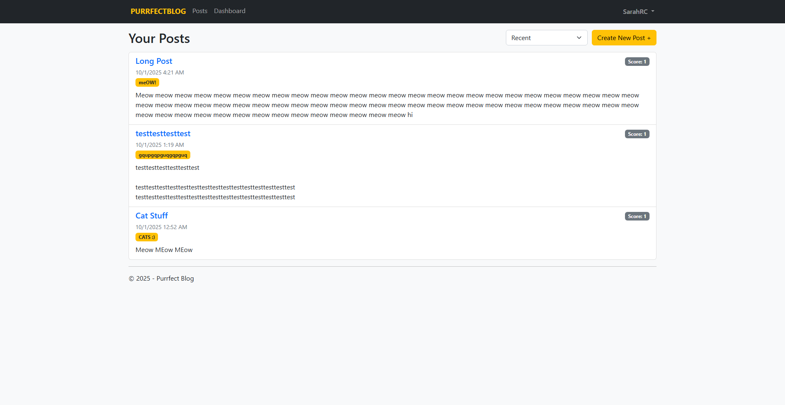

## General Information

Purrfect Blog is a simple, welcoming space where people can sign up, write posts, share thoughts, and browse what others have written. Visitors can read recent entries, open a post to see the full story, make changes if they need to fix something, or remove a post they no longer want visible. Other readers can show support (or disagreement) through a basic voting feature, helping the most appreciated posts rise to the top. If a post is removed, the site lets you know it no longer exists instead of showing an error. The goal is to provide a clean, friendly place to express ideas without extra clutter — quick to start using, easy to understand, and focused on writing and discovery.

## 🌐 Demo

[Demo Link](https://github.com/user-attachments/assets/6bf79926-a11d-4606-be6f-36d24a2108cc)

Demo Credentials:
- Username 1: siamese
- Password 1: Password1!
----------------------------------------
- Username 2: russian blue
- Password 2: Password2!
----------------------------------------
- Username 3: mainecoon
- Password 3: Password3!
----------------------------------------

## 📖 About this Software

Purrfect Blog is a lightweight ASP.NET MVC 5 ( .NET Framework 4.7.2 ) blogging application demonstrating a full CRUD + authentication workflow with voting and per‑author ownership rules. It is intentionally minimal, focusing on clarity and best practices over framework abstraction. Core pieces include:
•	Strongly-typed Razor views with Data Annotation validation
•	Post lifecycle: create, read (global + detail), edit, delete (author-only)
•	Voting system with toggle semantics (upvote / downvote / undo / flip)
•	Route customization (/post/{id}, /EditPost/{id})
•	Friendly 404-like experience for deleted posts
•	Dashboard filtered to the signed-in user
•	Basic security: anti-forgery tokens, authorization checks, ownership enforcement
•	Separation of domain models vs. view models for safer binding

This project can serve as:
  1.	A teaching aid for developers new to ASP.NET MVC & EF6.
  2.	A quick-start template for small content or community sites.
  3.	A portfolio artifact showing practical implementation of common web app patterns.

### Features:

- User registration & login (forms auth)
- Create / Edit / Delete your own posts
- View global posts with sorting:
  - Recent, Oldest, Most Upvoted, Most Downvoted
- Per‑user vote tracking (upvote / downvote toggle logic)
- Post detail pages: `/post/{id}`
- Friendly deleted post page (shows a custom message if the post no longer exists)
- Author-only edit route: `/EditPost/{id}`
- Dashboard showing only the signed-in user’s posts
- Basic server-side validation via Data Annotations
- Anti-forgery protection on forms

## 🖼️ Screenshots

To give you a visual overview of the application, here are some screenshots:

### [Dashboard]

### [Home Screen]

### [Login Screen]

### [Posts Screen]

### [Register Screen]

